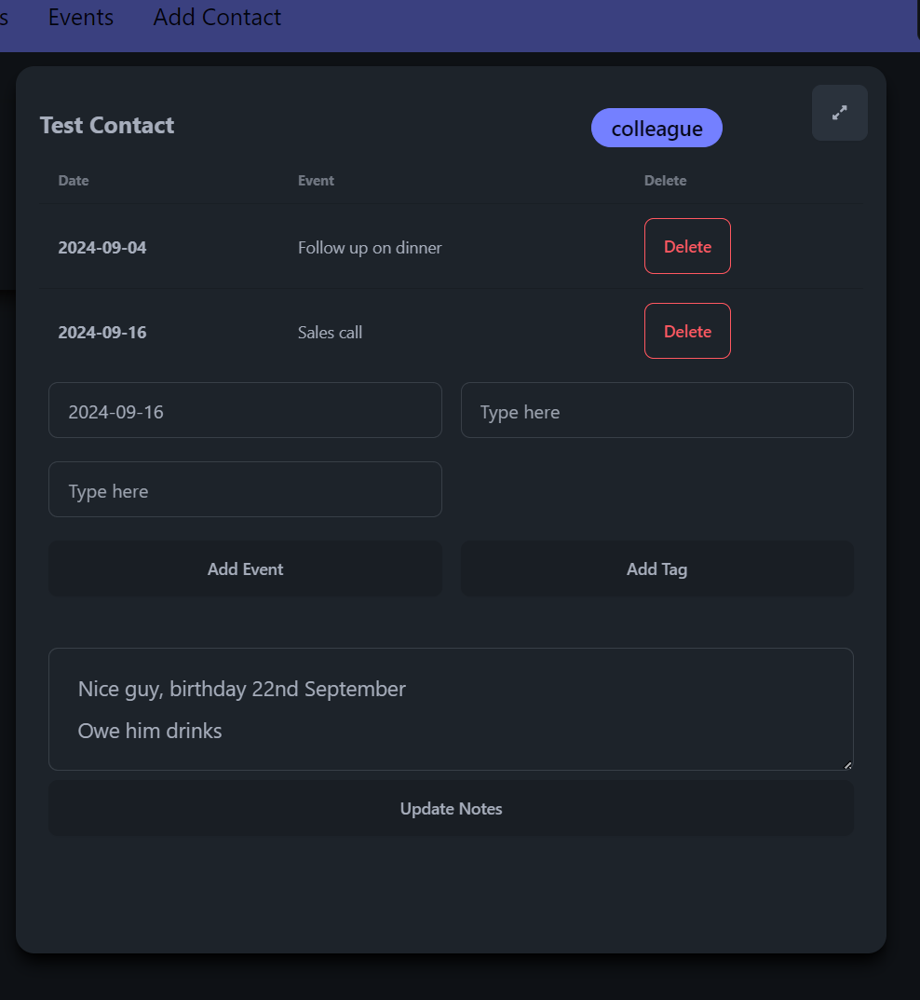

# Power Contacts
Leverages the power of plain text.

### Tags & Events:
- You need tags to organise people from different areas of life
- Tags are great for associating certain people with certain contexts, like work/school/some other venue
- Events are anything with a date - could be a future task, or a past appointment

You can have all this information stored _somewhere_. I have gone through so many notes apps, like Notion/Obsidian. But 
at the end of the day you need this to be accessible. You need to get on your phone and dial. So instead of crafting a whole
CRM system on Notion - which you will never use, why not just have everything stored on your regular list of contacts anyway, 
and have it sync over to your phone?

### Point of this tool
- I have used this method to keep track of my contacts for years now. On my iPhone, all tags/events are searchable, because
it is just plain text. Searching `#sometag` will give me a list of contacts that have the text `#sometag` 
in its 'notes'/'biographies' section.
- I have always craved a good GUI for this - and I figured no one would build it for me, might as well do it myself 
and share it to the world. 

### Usage 
- You need to set up a Google Cloud app to be able to use this. (it's free)
- Register yourself as the sole tester for your app.
- Set up the OAuth2.0 consent screen.
- More info [on the official Docs](https://developers.google.com/workspace/guides/create-credentials)
- Make sure you enable the People API
- Once you got all set up, you will receive a `credentials.json` - this will be the key to
accessing your Google Cloud app.
- Paste it into the install directory. 
- When you launch main.py/the executable, it will automatically redirect you to the OAuth screen you had set up.
- You only have to accept the terms once. A `token.json` will be generated
at the root directory for future access.
- Your should now be able to manage your contacts with Power Contacts.

### Future

Might make one for microsoft API or what have you. I don't know.

