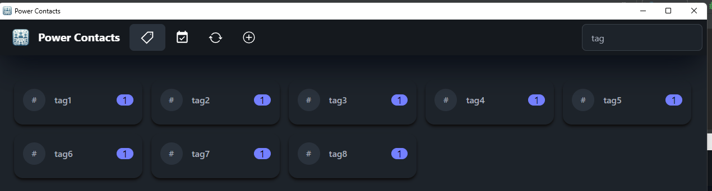
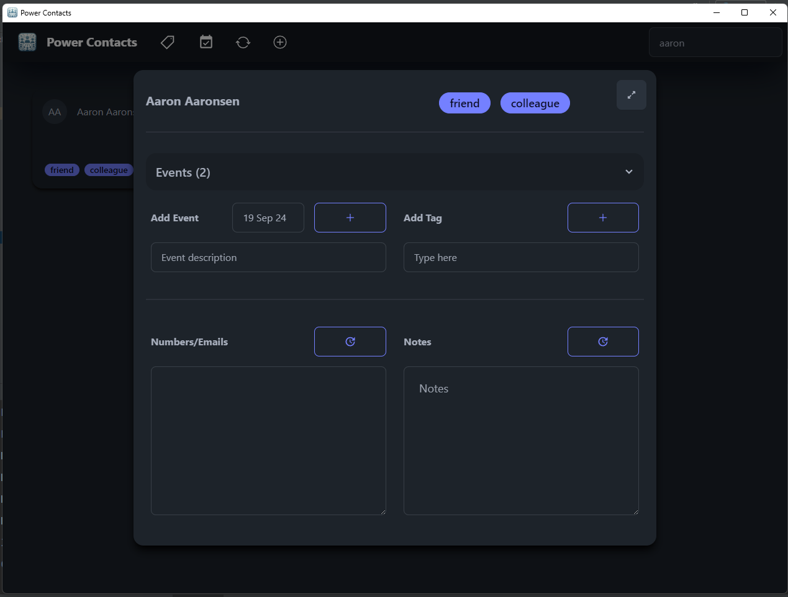
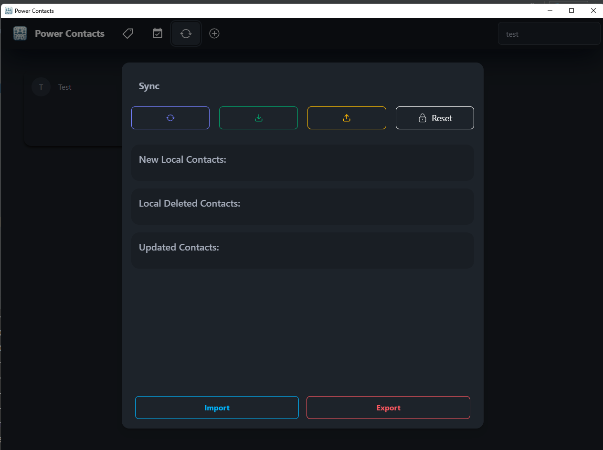

# Power Contacts
Leverage the power of plain text.

---

# Power Contacts

## Overview

Power Contacts is an intuitive contact management tool designed to enhance how you organize and access your network. Built with an offline-first approach, it offers seamless integration with Google Contacts, allowing you to sync and manage your contacts effortlessly.

## Features

- **Tagging System:** Easily add and manage tags for your contacts. Use tags like `#work`, `#school`, or any custom label to categorize your network efficiently.
- **Event Tracking:** Attach events (past or future) to your contacts with simple date annotations.
- **Advanced Search:** Use the signature feature to filter contacts by multiple tags. For example, searching `tag1,tag2` will show contacts that match both tags, providing a powerful way to navigate your network.
- **Offline-First:** Access and manage your contacts without an internet connection. Your data is stored locally, ensuring that you own it.
- **Syncing Mechanism:** With a straightforward pull-push-merge sync process, keep your local contacts up-to-date with Google Contacts.

## Setup

1. **Google Cloud Setup:** 
   - Create a Google Cloud project.
   - Set up OAuth 2.0 in the Google Cloud console.
   - Enable the People API. [Learn more](https://developers.google.com/workspace/guides/create-credentials)

2. **Credentials Handling:** 
   - Download the `credentials.json` from your Google Cloud project.
   - Place it in the install directory.

3. **Launching the App:**
   - Run `main.py` or the executable.
   - Follow the OAuth screen instructions to authorize access.
   - A `token.json` will be generated for future access.

Power Contacts offers a robust and efficient solution for managing your connections. Start organizing your contacts today!